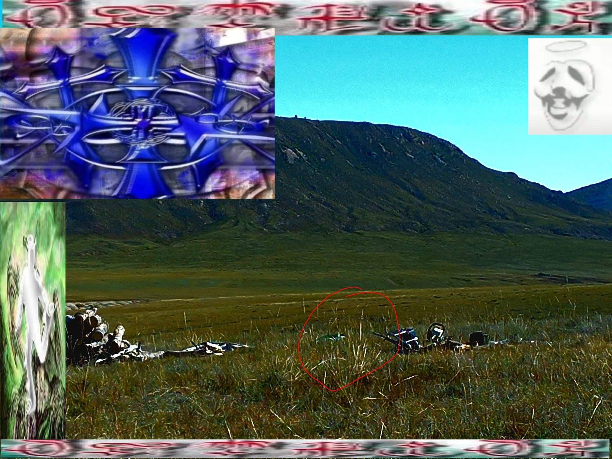

# Yabujin Escape Game — Code Explained

> [!tip] How to use this doc
> Sections marked **🎨 STYLING** are pure visual/appearance code. Skip them freely — they don't affect how things work. Everything else is **logic / functionality** you need to understand.

---

## Table of Contents

1. [[#Game Flow Overview]]
2. [[#File Structure]]
3. [[#HTML — Core Concepts]]
4. [[#CSS — Core Concepts]]
5. [[#JavaScript — Core Concepts]]
6. [[#Page-by-Page Breakdown]]
   - [[#index.html — The Field]]
   - [[#sha.js — The Anti-Cheat Helper]]
   - [[#clue1.html — The Bunker (Keypad)]]
   - [[#clue2.html — The Terminal]]
   - [[#clue3.html — The Archive (Forum)]]
   - [[#clue4.html — Azeroy (Glyph Gate)]]
   - [[#clue5.html — The Broadcast (Video)]]
   - [[#clue6.html — The Mirror (Card Selection)]]
   - [[#exit.html — Final Room + Easter Egg]]

---

## Game Flow Overview

The game is a **linear chain** of HTML pages:

```
index.html → clue1 → clue2 → clue3 → clue4 → clue5 → clue6 → exit.html
```

Each clue page has:
1. **Story text** — narrative context
2. **A puzzle widget** — the thing you interact with
3. **Answer validation** — JS checks if your answer is correct (via SHA-256 hash)
4. **A locked "next room" link** — hidden until you solve the puzzle

There's no server. Everything runs in the browser from static files.

---

## File Structure

```
index.html        — starting room (field scene with clickable zones)
clue1.html        — bunker / keypad puzzle
clue2.html        — terminal / fake command-line puzzle
clue3.html        — forum archive / acrostic puzzle
clue4.html        — azeroy gate / glyph alphabet puzzle
clue5.html        — broadcast / video lyric puzzle
clue6.html        — mirror / card-selection puzzle
exit.html         — final room / enter all 5 fragments + easter egg

style.css         — shared visual styles (used by all pages)
sha.js            — shared SHA-256 function (used by all clue pages)
```

> [!note] No build step, no frameworks
> This is plain HTML + CSS + JS. No React, no npm, no bundler. You open `index.html` in a browser and it just works.

---

## HTML — Core Concepts

### Document Structure

Every page starts with this boilerplate:

```html
<!DOCTYPE html>
<html lang="cs">
<head>
  <meta charset="UTF-8">
  <meta name="viewport" content="width=device-width, initial-scale=1.0">
  <title>guihetta // field</title>
  <link rel="stylesheet" href="style.css">
  <style>/* page-specific styles */</style>
</head>
<body>
  <!-- content here -->
  <script src="sha.js"></script>
  <script>/* page logic */</script>
</body>
</html>
```

**What each part does:**
- `<!DOCTYPE html>` — tells the browser "this is modern HTML5, not old HTML"
- `<html lang="cs">` — marks the document language as Czech (for screen readers / SEO)
- `<meta charset="UTF-8">` — tells the browser to read text as UTF-8, so special characters (ᚨ ז ε) display correctly
- `<meta name="viewport">` — makes the page scale correctly on phones; without this, phones zoom out and show a tiny desktop view
- `<link rel="stylesheet" href="style.css">` — loads `style.css` as a stylesheet; it affects all elements on the page
- `<script src="sha.js">` — loads the SHA-256 helper before the page's own script (ordering matters: `sha.js` must come first because the page script calls `sha256()`)

---

### `<link>` vs `<style>` vs `<script>`

The game uses two CSS locations:
- `<link href="style.css">` — shared base styles (same across all pages)
- `<style>` block inside `<head>` — page-specific styles that override or add to the shared ones

And two JS locations:
- `<script src="sha.js">` — loads the shared `sha256()` function
- `<script>` block at bottom of `<body>` — page-specific logic

---

### Image Maps (`<map>` and `<area>`) — index.html

This is the core mechanic of the **index page**. An image map lets you define clickable zones over an image without JavaScript click math.

```html


<map name="field-map" id="field-map">
  <area href="clue1.html" shape="circle" coords="920,860,144" alt="something in the grass">
  <area class="dead-end" href="#" shape="rect" coords="1420,24,1600,552" data-msg="watching. always watching.">
</map>
```

**How it works:**
- `usemap="#field-map"` — links the `` to the `<map>` with that name
- Each `<area>` defines one clickable zone on the image
- `shape="circle"` with `coords="x,y,radius"` — defines a circular zone
- `shape="rect"` with `coords="x1,y1,x2,y2"` — defines a rectangular zone
- `href="clue1.html"` — where clicking takes you (like an `<a>` link)
- `href="#"` — goes nowhere; used for dead-end zones (JS prevents the jump)
- `data-msg="..."` — custom data attribute; JS reads this to show flavour text

**Problem:** The coords were authored for the image's natural size (1600×1200px). When the image is scaled smaller on screen, the coords need to be proportionally scaled too. That's what the `scaleMap()` JS function does.

---

### `data-*` Attributes

HTML lets you attach any custom data to an element using `data-` prefixed attributes:

```html
<area data-msg="signal detected. signal lost.">
```

In JavaScript you read it with:
```js
area.dataset.msg   // → "signal detected. signal lost."
```

This is the standard way to pass data from HTML to JS without using hidden elements or global variables.

---

### Forms and Inputs

Each puzzle page has a text input + submit button:

```html
<input type="text" id="frag-input" placeholder="decoded word" maxlength="20">
<button onclick="checkFragment()">submit</button>
```

- `type="text"` — standard text box
- `id` — lets JS find it with `document.getElementById('frag-input')`
- `placeholder` — greyed-out hint text shown when empty
- `maxlength="20"` — browser enforces a character limit
- `onclick="checkFragment()"` — when the button is clicked, JS runs `checkFragment()`

---

### `<iframe>` — Embedding YouTube

On clue5, a YouTube video is embedded:

```html
<iframe
  src="https://www.youtube-nocookie.com/embed/VXdnTLHvhtM?start=13&rel=0"
  title="YABUJIN — GARDEN"
  allowfullscreen
></iframe>
```

An iframe is a "window inside the page" that loads a completely separate webpage (in this case, YouTube's embed page). The browser treats it as a sandboxed external document.

`youtube-nocookie.com` is YouTube's privacy-enhanced embed domain — it doesn't set tracking cookies until the user clicks play.

---

### `aria-*` Attributes (Accessibility)

Several elements use `aria-*` attributes:

```html
<div id="output" aria-live="polite" aria-label="terminal output">
<div class="q-card" role="checkbox" aria-checked="false">
<div id="easter" role="dialog" aria-hidden="true">
```

- `aria-label` — gives a text name to elements that have no visible text (for screen readers)
- `aria-live="polite"` — tells screen readers: "when content here changes, announce it after the user finishes what they're doing"
- `role="checkbox"` — tells screen readers this div behaves like a checkbox
- `aria-hidden="true"` — hides element from screen readers (decorative or hidden)

These don't affect how the page looks or works visually — they make it usable by blind users.

---

### SVG (Scalable Vector Graphics)

The index page uses inline SVGs as decorative overlays:

```html
<svg viewBox="0 0 28 28" fill="none">
  <line x1="14" y1="2" x2="14" y2="26" stroke="rgba(180,160,180,0.35)" stroke-width="1"/>
  <line x1="2" y1="14" x2="26" y2="14" stroke="rgba(180,160,180,0.35)" stroke-width="1"/>
</svg>
```

SVG is a vector image format written in XML/HTML-like syntax. You define shapes with coordinates:
- `<line x1 y1 x2 y2>` — draws a line between two points
- `<ellipse cx cy rx ry>` — draws an ellipse
- `<polyline points="...">` — draws connected line segments

SVGs scale perfectly at any size (unlike raster images like JPG/PNG) and can be styled with CSS.

---

### The INTHA Letters (Hidden Text Trick)

Scattered across pages are nearly-invisible HTML elements. They have **no named IDs or classes** — all styling is inlined directly on the element so View Source gives no naming hint:

```html
<span style="position:absolute;bottom:3px;left:8px;font-size:9px;color:#060610;pointer-events:none;user-select:text;letter-spacing:0.1em;" aria-hidden="true">I</span>
```

> [!info] 🎨 STYLING — but also logic
> The letters are hidden using inline CSS: `color:#060610` (nearly same as background), `font-size:9px`. BUT the key functional property is `user-select:text` — this means if a user highlights all text on the page (Ctrl+A), the letter gets selected and shows up. This is intentional — it's how players discover the INTHA easter egg.

**Why no ID or class?** An element like `<span id="intha-i">` would immediately betray the secret word to anyone reading source. Using anonymous inline styles removes that hint entirely — the letter `I` appears in source with no label explaining what it is.

The letters spell **I-N-T-H-A** across five different pages. Typing that word on the keyboard at `exit.html` triggers the hidden ending.

---

## CSS — Core Concepts

### CSS Custom Properties (Variables)

`style.css` defines design tokens at the top:

```css
:root {
  --bg:      #04040a;
  --surface: #07070f;
  --text:    #b8b8cc;
  --accent:  #6e0016;
  --pale:    #222235;
  --mono:    'Courier New', Courier, monospace;
}
```

`:root` is the top-level element (same as `<html>`). Variables defined here are available everywhere in the stylesheet.

Usage anywhere in CSS:
```css
color: var(--text);
border: 1px solid var(--pale);
```

**Why use variables?** Change `--accent` in one place and it updates everywhere. Much easier than finding every hex code.

---

> [!info] 🎨 STYLING — skip if not curious about visuals

### The `.show` / `display:none` Toggle Pattern

This is the main way the game shows and hides things:

```css
/* Hidden by default */
.msg-err { display: none; }
.fragment { display: none; }
#next-link { display: none; }

/* JS adds this class to reveal */
.show { display: block !important; }
```

In JS:
```js
document.getElementById('err-msg').classList.add('show');    // show
document.getElementById('err-msg').classList.remove('show'); // hide
```

The `!important` overrides any other `display` value — it forces the element to become visible. This is the entire show/hide mechanism for all feedback messages, reward panels, and next-room links.

---

> [!info] 🎨 STYLING — pure visual, skip freely

### `position: absolute/relative/fixed`

Used constantly for overlaying elements:

- `position: relative` on a container — makes it the "reference box" for children
- `position: absolute` on a child — positions it relative to the nearest `position: relative` parent, using `top/left/right/bottom`
- `position: fixed` — positions relative to the browser window, stays in place when scrolling

Example from index.html: the pulsing ring over the bunker is `position: absolute` inside `#field` which is `position: relative`.

---

> [!info] 🎨 STYLING — skip

### `pointer-events: none`

```css
.overlay { pointer-events: none; }
```

This makes an element "invisible" to mouse clicks. Clicks pass through it to whatever is behind it. Used extensively for decorative overlays so they don't block the image map click zones.

---

> [!info] 🎨 STYLING — skip

### `clamp()` — Fluid Sizing

```css
html { font-size: clamp(13px, 0.5vw + 10.5px, 19px); }
```

`clamp(min, preferred, max)` returns:
- `min` if preferred is smaller than min
- `max` if preferred is larger than max
- `preferred` otherwise

This makes the font size fluid — it grows as the viewport widens, but never below 13px or above 19px. Since all other sizes use `rem` (relative to root font size), everything scales together.

---

> [!info] 🎨 STYLING — skip

### `::before` / `::after` Pseudo-elements

```css
body::after {
  content: '';
  position: fixed;
  inset: 0;
  background-image: linear-gradient(...);
  pointer-events: none;
  z-index: 9000;
}
```

`::before` and `::after` create a virtual element that appears before/after the element's content. They require `content: ''` to exist. They're used here to layer the CRT scanline effect over the entire page without adding any extra HTML.

`inset: 0` is shorthand for `top:0; right:0; bottom:0; left:0` — makes it cover the full parent.

---

> [!info] 🎨 STYLING — skip

### CSS Grid

Used in clue3 (forum posts) and the exit page:

```css
.post {
  display: grid;
  grid-template-columns: 140px 1fr;
}
```

Grid turns the element into a 2-column layout:
- First column: fixed 140px wide (user info sidebar)
- Second column: `1fr` = "take the remaining space"

Children of `.post` automatically flow into these columns left-to-right.

---

> [!info] 🎨 STYLING — skip

### CSS Flexbox

```css
.nav {
  display: flex;
  justify-content: space-between;
  align-items: center;
}
```

Flexbox arranges children in a row (or column). `justify-content: space-between` pushes children to opposite ends — this is how the "← back" and "return to field →" buttons end up on opposite sides of the nav bar.

---

## JavaScript — Core Concepts

### `sessionStorage` — Per-Tab Progress

```js
// On index.html, clear any old progress
sessionStorage.clear();

// On clue1.html, when puzzle solved:
sessionStorage.setItem('s1', '1');

// On returning to clue1.html, auto-show solved state:
if (sessionStorage.getItem('s1')) showSolved();
```

`sessionStorage` is a browser API that stores key-value pairs of strings. It persists **within a single browser tab session** — if you close the tab and reopen, it's gone.

Each clue sets its own key (`s1` through `s6`, `sx` for exit) when solved. When the page loads, JS checks if that key exists and restores the solved state automatically (so you don't have to re-solve if you navigate back).

`index.html` calls `sessionStorage.clear()` on every load — this resets the whole game when you return to the start page.

---

### SHA-256 Anti-Cheat System (`sha.js`)

**The problem:** If you store answers in the HTML source code, any player can right-click → View Source and read all the answers.

**The solution:** Store only the SHA-256 hash of the answer. Hash the player's input and compare hashes. If they match, the answer is correct.

```js
// sha.js — the helper function
async function sha256(str) {
  const data = new TextEncoder().encode(str);   // string → bytes
  const buf  = await crypto.subtle.digest('SHA-256', data);  // hash
  return [...new Uint8Array(buf)].map(b => b.toString(16).padStart(2, '0')).join('');
  // convert hash bytes → hex string like "fef2ec95..."
}
```

**Breaking this down:**
1. `new TextEncoder().encode(str)` — converts the text string into raw bytes (UTF-8 encoding)
2. `crypto.subtle.digest('SHA-256', data)` — runs SHA-256 on those bytes; returns a Promise because it's a cryptographic operation (could be slow on huge inputs)
3. `new Uint8Array(buf)` — wraps the result as an array of numbers (0–255)
4. `.map(b => b.toString(16).padStart(2, '0'))` — converts each byte to a 2-character hex string: `255` → `"ff"`, `10` → `"0a"`
5. `.join('')` — glues them all into one long hex string

**SHA-256** is a one-way cryptographic hash function: given the same input, it always produces the same 64-character hex string. You cannot reverse it to get the original input. Players can see the hash in source, but cannot derive the answer from it.

---

### `async` / `await` and Promises

`sha256()` returns a **Promise** — a placeholder for a value that will be available in the future. This is because hashing is asynchronous.

```js
// Without await (doesn't work — h is a Promise object, not a string)
const h = sha256('NODE');
if (h === ANSWER_HASH) { ... }  // WRONG

// With async/await (correct)
async function checkFragment() {
  const h = await sha256('NODE');
  if (h === ANSWER_HASH) { ... }  // RIGHT
}
```

`await` pauses execution inside the `async` function until the Promise resolves, then gives you the actual value. The rest of the page keeps running — only this function waits.

The older style (`.then()`):
```js
sha256(val).then(h => {
  if (h === ANSWER_HASH) { ... }
});
```

Both do the same thing. Different pages in this game use both styles.

---

### DOM Manipulation

"DOM" = Document Object Model — the browser's tree representation of the HTML. JS can read and modify it.

**Finding elements:**
```js
document.getElementById('frag-input')      // find by id attribute
document.querySelector('.q-card.selected') // find by CSS selector (first match)
document.querySelectorAll('area.dead-end') // find all matches → NodeList
```

**Creating and appending elements:**
```js
const div = document.createElement('div');  // create a new <div>
div.className = 'line-out';                 // set its class
div.textContent = 'some text';              // set its text
output.appendChild(div);                   // add it as last child of #output
```

This is how the terminal in clue2 works — every command output is a new `<div>` appended to `#output`.

**Reading/writing content:**
```js
display.textContent = code.padEnd(4, '_');  // set text
popup.textContent = msg;
```

**Changing visibility:**
```js
element.style.display = 'block';           // show inline
element.classList.add('show');             // add a CSS class
element.classList.remove('show');          // remove a CSS class
element.classList.toggle('selected');      // add if absent, remove if present
```

---

### Event Listeners

The main way JS reacts to user actions:

```js
// Click event
area.addEventListener('click', e => {
  e.preventDefault();  // stop the browser's default action (following the link)
  // ...
});

// Keyboard event
document.addEventListener('keydown', e => {
  if (e.key === 'Enter') checkCode();
  if (e.key >= '0' && e.key <= '9') typeDigit(e.key);
});
```

`e` is the Event object — it has info about what happened:
- `e.key` — which key was pressed (`'Enter'`, `'a'`, `'ArrowUp'`, etc.)
- `e.preventDefault()` — cancels the browser's default reaction (e.g., stops a link from navigating)

---

### Image Map Coordinate Scaling — index.html

The image map coords were designed for the image at its natural 1600×1200 pixel size. When the image is shown smaller (it's responsive), those coords would be wrong. This JS scales them:

```js
function scaleMap() {
  const naturalW  = img.naturalWidth  || 1600;  // actual pixel size of image file
  const naturalH  = img.naturalHeight || 1200;
  const renderedW = img.offsetWidth;             // size it's displayed at
  const renderedH = img.offsetHeight;

  const sx = renderedW / naturalW;  // scale factor: e.g. 0.5 if displayed at half size
  const sy = renderedH / naturalH;

  areas.forEach(a => {
    const orig = a.dataset.origCoords.split(',').map(Number);
    // For each coord: even indices are X (multiply by sx), odd are Y (multiply by sy)
    const scaled = orig.map((v, i) => Math.round(i % 2 === 0 ? v * sx : v * sy));
    a.setAttribute('coords', scaled.join(','));
  });
}

img.addEventListener('load', scaleMap);     // run after image loads
window.addEventListener('resize', scaleMap); // re-run on window resize
if (img.complete) scaleMap();               // run immediately if already loaded
```

**Why `i % 2 === 0` selects X coords:** Coords come as a flat list `x1,y1,x2,y2,...`. Even indices (0, 2, 4...) are always X values. Odd indices (1, 3, 5...) are always Y values.

---

### Virtual Filesystem — clue2.html

The terminal puzzle fakes a real filesystem using a plain JavaScript object:

```js
const FS = {
  'note.txt': [
    '[ note.txt ]',
    'she was here.',
    // ...
  ],
  '.echo': [
    'T : ABQR',
    // ...
  ],
};

const VISIBLE_FILES = ['note.txt', 'log_final.txt', 'DONT_OPEN.exe'];
const ALL_FILES     = [...VISIBLE_FILES, '.echo'];  // spread adds .echo to the list
```

`FS` is just a plain object where:
- Keys = filenames
- Values = arrays of strings (lines of the file)

The `cat` command looks up the filename in `FS`:
```js
if (FS[fname]) {
  FS[fname].forEach(line => print(line));
} else {
  print(`cat: ${fname}: no such file or directory`, 'line-err');
}
```

`ls` just prints the visible file list. `ls -a` prints the full list (including `.echo`).

---

### Command History — clue2.html

The terminal supports ↑/↓ arrow keys to cycle through previous commands:

```js
const history = [];  // array of past commands, newest first
let histIdx   = -1;  // current position in history (-1 = not browsing)

function runCommand(raw) {
  history.unshift(cmd);  // add to front of array
  histIdx = -1;          // reset position
  // ...
}

cmdInput.addEventListener('keydown', e => {
  if (e.key === 'ArrowUp') {
    e.preventDefault();
    if (histIdx < history.length - 1) histIdx++;
    cmdInput.value = history[histIdx] || '';
  } else if (e.key === 'ArrowDown') {
    e.preventDefault();
    if (histIdx > 0) histIdx--;
    else { histIdx = -1; cmdInput.value = ''; return; }
    cmdInput.value = history[histIdx] || '';
  }
});
```

`history.unshift()` adds to the start of the array (so `history[0]` is always the most recent command). The index counts up as you press ↑ (going back in time) and down as you press ↓ (coming forward).

---

### Rolling Buffer — exit.html (INTHA Easter Egg)

Detecting a secret word typed anywhere on the keyboard — **without storing the word in source**:

```js
// The secret word is never written here — only its SHA-256 hash
const SECRET_HASH = 'b8218ead8e0e737fc1070d4fccd0bf9392517f6b602fd6debfaf6fe769069c32';
const SECRET_LEN  = 5;
let keyBuf        = '';

document.addEventListener('keydown', e => {
  if (e.key === 'Escape') { closeEaster(); return; }
  if (e.key.length !== 1) return;  // ignore Enter, Shift, ArrowUp, etc.

  keyBuf += e.key.toUpperCase();
  if (keyBuf.length > SECRET_LEN) {
    keyBuf = keyBuf.slice(-SECRET_LEN);
  }

  if (keyBuf.length < SECRET_LEN) return;  // wait until buffer is full

  // Hash buffer and compare — never compare against plaintext
  sha256(keyBuf).then(h => {
    if (h === SECRET_HASH) {
      openEaster();
      keyBuf = '';
    }
  });
});
```

**Why a rolling buffer?** If the player types "XINTHA", without rolling, the buffer would be "XINTHA" and never match. By always keeping only the last 5 characters (`slice(-5)`), the buffer becomes the right word at the right moment.

**Why SHA-256 here too?** Same reason as puzzle answers — `const SECRET = 'INTHA'` in source would immediately reveal the trigger word to anyone doing View Source. Storing only the hash means the word is unguessable from the code. The only way to know what to type is to find the scattered letters in-game.

`e.key.length !== 1` filters out special keys — `'Enter'` has length 5, `'ArrowUp'` has length 7, but regular characters like `'a'` or `'I'` have length 1.

---

### `Promise.all` — clue6.html

When checking multiple card selections simultaneously:

```js
const hashes = await Promise.all(
  selected.map(c => sha256(c.dataset.text))
);
```

`selected.map(c => sha256(...))` creates an **array of Promises** (one hash computation per card).

`Promise.all([p1, p2, p3])` waits for ALL of them to finish, then returns an array of all results. Faster than awaiting them one at a time.

---

### Fisher-Yates Shuffle — clue6.html

When the player picks wrong cards, the cards are reshuffled to prevent guessing by position:

```js
function shuffle(arr) {
  for (let i = arr.length - 1; i > 0; i--) {
    const j = Math.floor(Math.random() * (i + 1));
    [arr[i], arr[j]] = [arr[j], arr[i]];  // swap two elements
  }
}
```

This is the Fisher-Yates algorithm — the correct way to shuffle an array randomly. It works backwards from the last element, swapping each with a randomly chosen earlier element.

`[arr[i], arr[j]] = [arr[j], arr[i]]` is JS **destructuring assignment** — it swaps two values without a temp variable.

---

### `Set` Data Structure — clue6.html

```js
const REAL_HASHES = new Set([
  '7e09bbd1...',
  '6f15a7a5...',
  '92c50f40...',
]);

// Check if all selected hashes are in the real set
if (hashes.every(h => REAL_HASHES.has(h))) { ... }
```

A `Set` is like an array but with no duplicates and fast `.has()` lookup. `REAL_HASHES.has(h)` is instant regardless of set size — much faster than `array.includes(h)` on large arrays (though size here is tiny).

`hashes.every(fn)` returns `true` only if `fn` returns `true` for every element.

---

## Page-by-Page Breakdown

### index.html — The Field

**Functionality:**
- Loads with `sessionStorage.clear()` — fresh game every time you visit the main page
- Image map with 5 clickable zones over a field photo
- Zones scale to actual image size via `scaleMap()`
- 4 "dead-end" zones show flavour text popup, don't navigate
- 1 zone (bunker) navigates to `clue1.html`

**Key logic:**
```js
// Dead-end zones show popup instead of navigating
document.querySelectorAll('area.dead-end').forEach(area => {
  area.addEventListener('click', e => {
    e.preventDefault();  // cancel link navigation
    popup.textContent = area.dataset.msg;  // read message from data attribute
    popup.classList.add('show');           // show toast
    clearTimeout(popTimer);
    popTimer = setTimeout(() => popup.classList.remove('show'), 2400);  // hide after 2.4s
  });
});
```

> [!info] 🎨 STYLING
> The pulsing ring (`#o-entrance`), cross SVG, signal lines SVG, eye SVG are all purely decorative overlays with `pointer-events:none`. They don't affect clicking.

---

### sha.js — The Anti-Cheat Helper

```js
async function sha256(str) {
  const data = new TextEncoder().encode(str);
  const buf  = await crypto.subtle.digest('SHA-256', data);
  return [...new Uint8Array(buf)].map(b => b.toString(16).padStart(2, '0')).join('');
}
```

This file is loaded once via `<script src="sha.js">` on every clue page. It exposes one function: `sha256(string) → Promise<hexString>`.

**Requires a secure context** — `https://`, `localhost`, or `file://`. GitHub Pages is HTTPS, so it works.

---

### clue1.html — The Bunker (Keypad)

**Puzzle:** Read numbers on the bunker walls, find that 1 and 6 repeat (wall note says "1 and 6 = chaos"), enter `1616`.

**State variables:**
```js
let solved = false;  // prevents re-triggering
let code   = '';     // current digit buffer (up to 4 chars)
const ANSWER_HASH = 'ee09198e...';  // SHA-256 of '1616'
```

**Key functions:**
- `typeDigit(d)` — appends digit to `code`, updates display
- `clearInput()` — resets `code` and display
- `checkCode()` — hashes `code`, compares to `ANSWER_HASH`, unlocks if correct
- `showSolved()` — sets `sessionStorage.s1`, shows next-room link

**Keyboard support:**
```js
document.addEventListener('keydown', e => {
  if (e.key >= '0' && e.key <= '9') typeDigit(e.key);
  if (e.key === 'Enter')            checkCode();
  if (e.key === 'Backspace')        clearInput();
});
```

> [!info] 🎨 STYLING
> Bunker interior photo uses `filter: brightness(0.65) contrast(1.15) saturate(0.4)` to look dark and desaturated. The number marks (`.mark`) are absolutely positioned as `%` of image width/height. The wall note is rotated 2deg to look pinned.

---

### clue2.html — The Terminal

**Puzzle:** Type `ls` → `cat note.txt` → `ls -a` → `cat .echo` → apply ROT13 to `ABQR` → get `NODE` → submit.

**Terminal architecture:**
- `FS` object = fake filesystem (keys = filenames, values = arrays of lines)
- `VISIBLE_FILES` vs `ALL_FILES` — controls what `ls` and `ls -a` return
- `print(text, class)` — appends a styled `<div>` to `#output`
- `runCommand(raw)` — parses command string, dispatches to if/else blocks

**Commands implemented:** `help`, `ls`, `ls -a`, `cat [file]`, `whoami`, `date`, `clear`

**Fragment submission** is separate from the terminal — separate input + button → `checkFragment()` → SHA-256 check → `sessionStorage.s2`

> [!info] 🎨 STYLING
> The terminal is styled purple/magenta (not green) via a second `<style>` block that overrides the first. The `#terminal-frame::before` pseudo-element shows a static CRT screenshot image behind the text, hue-shifted to violet. `lain-peek.png` is `position:fixed` in the bottom-right corner.

---

### clue3.html — The Archive (Forum)

**Puzzle:** Read Guihetta's post — first letter of each sentence spells **S-I-G-N-A-L**. Submit `SIGNAL`.

**Logic:** Entirely in the HTML structure. The acrostic is visible in the `<strong>` bolded first letters. JS only handles the submit → SHA-256 check → `sessionStorage.s3`.

**INTHA H:** Hidden in the post number `#<span class="intha-h">H</span>1188` — the H is same colour as background.

> [!info] 🎨 STYLING
> The forum widget is a styled `div` made to look like a 2003-era phpBB dark forum. Post rows use CSS Grid (`140px 1fr`) for user-info sidebar and post body columns. All purely visual.

---

### clue4.html — Azeroy (Glyph Gate)

**Puzzle:** Six glyphs on a gate: `ᚨ ז ε ᚱ ᛟ υ` — these are A Z E R O Y in Elder Futhark (Norse runes), Hebrew, Greek. Submit `AZEROY`.

**Logic:** Same pattern: input → `checkFragment()` → SHA-256 → `sessionStorage.s4`.

**Yabumon Easter Egg:**
```js
function toggleYabumon(on) {
  document.getElementById('yabumon').classList.toggle('show', on);
}
```

A button labelled "yabumon" (barely visible) opens a full-screen overlay with a holographic trading card. `classList.toggle('show', on)` — the second argument forces the class on (true) or off (false) rather than toggling.

> [!info] 🎨 STYLING
> The azeroy scene image is hue-rotated to violet. The gate is an absolutely positioned div with glowing border and box-shadow. The yabumon overlay uses an animated holographic gradient (`@keyframes holo`) and a floating card animation (`@keyframes ymon-float`).

---

### clue5.html — The Broadcast (Video)

**Puzzle:** Watch the YABUJIN — GARDEN video. Chorus says "garden of blood." Submit `BLOOD`.

**Logic:** Simplest page — just an iframe embed + same submit → SHA-256 → `sessionStorage.s5` pattern.

**Responsive video embed technique:**
```css
#video-wrap {
  position: relative;
  width: 100%;
  padding-top: 56.25%;  /* 16:9 = 9/16 = 56.25% */
}
#video-wrap iframe {
  position: absolute;
  top: 0; left: 0;
  width: 100%; height: 100%;
}
```

This is the classic CSS trick for responsive iframes. `padding-top: 56.25%` makes the container's height equal to 56.25% of its width — exactly 16:9 ratio. The iframe fills it absolutely.

**INTHA A:** Hidden in `frequency 40.16<span id="intha-a">A</span>` — same colour as background.

---

### clue6.html — The Mirror (Card Selection)

**Puzzle:** 6 cards displayed. 3 are real YABUJIN GARDEN lyrics, 3 are invented. Pick the 3 real ones. Correct = `RETURN`.

**Anti-cheat:** Correct card texts are not marked in source. Their SHA-256 hashes are stored in `REAL_HASHES` (a Set). JS hashes the selected card text and checks if it's in the set.

```js
async function checkSelection() {
  const selected = [...document.querySelectorAll('.q-card.selected')];
  if (selected.length !== 3) { show('err-msg'); return; }

  const hashes = await Promise.all(selected.map(c => sha256(c.dataset.text)));
  if (hashes.every(h => REAL_HASHES.has(h))) {
    showSolved();
  } else {
    show('err-msg');
    shuffle(CARDS);    // reshuffle on wrong attempt
    renderCards();     // re-render with new order
  }
}
```

**Cards are rendered by JS**, not hardcoded HTML:
```js
function renderCards() {
  CARDS.forEach(text => {
    const div = document.createElement('div');
    div.className = 'q-card';
    div.dataset.text = text;   // store text for hashing
    div.innerHTML = `<div class="q-text">${text}</div>`;
    div.addEventListener('click', () => toggleCard(div));
    grid.appendChild(div);
  });
}
```

**Card toggle:**
```js
function toggleCard(card) {
  if (solved) return;  // no changes after solved
  const on = card.classList.toggle('selected');        // flip state
  card.setAttribute('aria-checked', String(on));       // update accessibility
}
```

> [!info] 🎨 STYLING
> The `gates-azeroy.jpg` wallpaper is `position:fixed; z-index:-2` — behind everything. Its `::after` pseudo-element adds a dark transparent veil (`rgba(3,2,8,0.80)`) so text remains readable over the image. The pixel-border is a CSS `border-image` trick using a repeating gradient.

---

### exit.html — Final Room + Easter Egg

**Puzzle:** Enter all 5 collected fragments in order: `NODE / SIGNAL / AZEROY / BLOOD / RETURN`.

**Validation logic:**
```js
const ANSWER_HASHES = {
  f1: 'fef2ec95...',  // NODE
  f2: '8e1a5272...',  // SIGNAL
  f3: '9cb1602c...',  // AZEROY
  f4: 'c9f5b994...',  // BLOOD
  f5: 'c3172d0b...',  // RETURN
};

async function checkFragments() {
  let allOk = true;
  for (const [id, hash] of Object.entries(ANSWER_HASHES)) {
    const el = document.getElementById(id);
    const h  = await sha256(el.value.trim().toUpperCase());
    if (h === hash) {
      el.classList.add('ok');    // green border on correct input
    } else {
      el.classList.remove('ok');
      allOk = false;
    }
  }
  if (allOk) showEpilogue();
  else show('err-msg');
}
```

`Object.entries(obj)` returns `[['f1', 'hash...'], ['f2', 'hash...'], ...]` — lets you loop over an object's key-value pairs.

**INTHA Easter Egg (Rolling Buffer + SHA-256):**
- Keyboard listener on the entire `document`
- Rolling 5-char buffer via `keyBuf.slice(-5)`
- On each keystroke with a full buffer: `sha256(keyBuf)` compared to `SECRET_HASH` — the word never appears in source
- Match: open overlay, set iframe src (starts video autoplay)
- Escape key closes overlay and clears iframe src (stops video)

```js
function openEaster() {
  const iframe = document.getElementById('chalice-iframe');
  // Only set src on first open — prevents restarting video if overlay is closed and reopened
  if (!iframe.src || iframe.src === window.location.href) {
    iframe.src = 'https://www.youtube-nocookie.com/embed/CPJdg54Cy3M?autoplay=1';
  }
  document.getElementById('easter').classList.add('show');
}

function closeEaster() {
  document.getElementById('easter').classList.remove('show');
  document.getElementById('chalice-iframe').src = '';  // clear src = stops video
}
```

> [!info] 🎨 STYLING
> The exit background image is `opacity: 0.10`, becoming `opacity: 0.16` after the epilogue reveals (via `body.classList.add('revealed')`). The easter egg overlay uses a glowing floating logo (`@keyframes floaty`), holographic shifting text (`@keyframes holo`), a rainbow `border-image` on the anime art, and a responsive video wrapper.

---

## Summary: The Repeated Pattern

Every clue page (1–6) follows this exact same structure:

```
1. Load page
2. Check sessionStorage for this room's key → if found, call showSolved() immediately
3. Player interacts with puzzle widget
4. Player submits answer
5. JS: sha256(input.toUpperCase()) → compare to ANSWER_HASH
6. If correct: sessionStorage.setItem(key, '1'), show success, reveal next-room link
7. If wrong: show error message
```

This pattern repeats 6 times with different puzzle widgets but identical underlying logic. Once you understand it once, you understand all of them.
